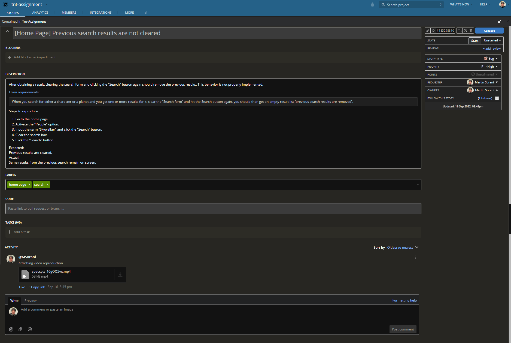

# Assesment Solution

## Update to Node 16
_"We have left the angular + cypress builder configuration empty in angular.json file, we'll leave it to you to update it"_ \
This project contains a hard dependency on cypress schematics, which no longer support Angular < 13, so the project has been updated for usage with Node 16 and Angular 14 (latest versions as of now). TSLint is also deprecated so it has been removed; linting is now covered with ESLint.

## Karma config update
Original Karma config did not take into account already running instances or launches. Although the assesment does not require a unit testing framework or unit tests at all, Karma config has been updated for the sake of compliance patterns.

## Cypress e2e
Automated test scenarios for the UI are handled by Cypress and written in mocha style. An .html report is automatically generated inside the [cypress/reports](./cypress/reports/) folder after each run. Failed test cases will have a screenshot attached.\
Run the full spec by using the command ```ng e2e```. Add the parameter ```--browser``` to specify a target browser. Supported browsers are **chrome**, **firefox** and **edge**. Note that in order to execute the test scenarios in any of these browsers, you'd need to have them installed on your system.

## Bug report
A bug report has been filed to the project's mock board. Since access to the Pivotal Tracker board cannot be freely provided, a screenshot of the bug report has been attached to the [cypress/bug](./cypress/bug/) folder.

<br>



</br>

--------------------

## Test scenarios
The following test scenarios have been automated for this project:

### TC01: Should contain header Star Wars
1. Given a user navigates to the home page
2. Then home page should display a header containing the words 'Star Wars'

### TC02: Should return people result
1. Given a user navigates to the home page
2. When a user selects the people radio button
3. And a user types in 'C-3PO' inside the search box
4. And a user clicks the search button
5. Then a single result is returned

### TC03: Should return planet result
1. Given a user navigates to the home page
2. When a user selects the planets radio button
3. And a user types in 'Tatooine' inside the search box
4. And a user clicks the search button
5. Then a single result is returned

### TC04: Should be able to search using the enter key
1. Given a user navigates to the home page
2. When a user selects the people radio button
3. And a user types in 'Leia' inside the search box
4. And a user presses the {Enter} key
5. Then a single result is returned

### TC05: Should yield several results
1. Given a user navigates to the home page
2. When a user selects the people radio button
3. And a user types in 'Skywalker' inside the search box
4. And a user clicks the search button
5. Then more than 1 results are returned

### TC06: Should not find anything
1. Given a user navigates to the home page
2. When a user selects the people radio button
3. And a user types in 'something' inside the search box
4. And a user clicks the search button
5. Then no results are returned

### TC07: Should display not found message
1. Given a user navigates to the home page
2. When a user selects the planet radio button
3. And a user types in 'Alderaan' inside the search box
4. And a user clicks the search button
5. Then a single result is returned
6. When a user selects the people radio button
7. And a user clicks the search button
8. Then a message with the text 'Not found.' is displayed

### TC08: Should clear previous search results
1. Given a user navigates to the home page
2. When a user selects the people radio button
3. And a user types in 'Lars' inside the search box
4. And a user clicks the search button
5. Then several results are returned
6. When a user clears the search box
7. And a user clicks the search button
8. Then the previous results are no longer displayed